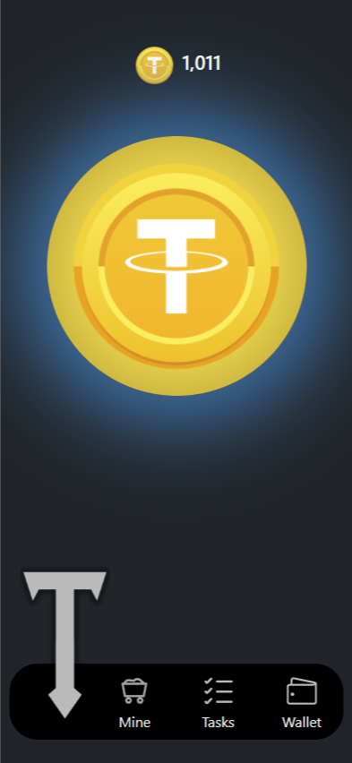
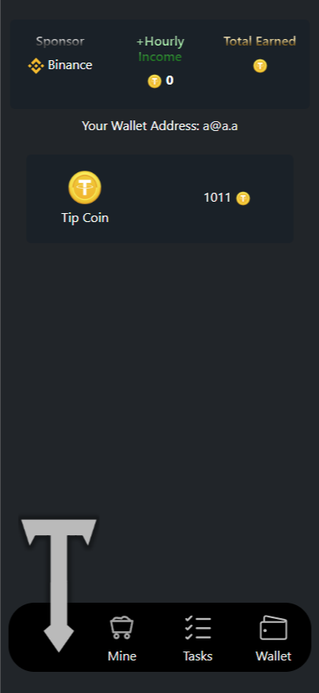

# Flask-Ton-Game

**Flask-Ton-Game** is an innovative web-based gaming framework that merges interactive gameplay with secure blockchain-inspired wallet integration. Built on the Flask framework, it offers a solid foundation for exploring TON wallet authentication and real-time in-game currency mechanics—all wrapped in a modern, dynamic interface.

---

## Table of Contents

- [Overview](#overview)
- [Features](#features)
- [Project Structure](#project-structure)
- [Installation](#installation)
- [Usage](#usage)
- [Screenshots](#screenshots)
- [Roadmap](#roadmap)
- [Contributing](#contributing)
- [License](#license)
- [Contact](#contact)

---

## Overview

Flask-Ton-Game is designed for developers and gamers alike who are interested in cutting-edge web gaming integrated with blockchain concepts. Key highlights include:

- **TON Wallet Integration:** Register and log in by providing a valid TON wallet address.
- **Interactive Gameplay:** Earn in-game currency by interacting with a clickable coin which updates your balance in real time.
- **Modular & Scalable:** Built using Flask with SQLAlchemy, Flask-Login, and Flask-Migrate, the project is poised for future extensions like multiplayer features and blockchain transactions.

---

## Features

### Backend
- **User Authentication:** Secure login and registration via TON wallet addresses using Flask-Login.
- **Database Management:** Structured using SQLAlchemy and managed with Flask-Migrate. (*Note: The database is pre-initialized and included in the repository.*)
- **Security:** Implements per-session CSRF tokens and robust password hashing.

### Frontend
- **Responsive Design:** Built with Bootstrap and custom CSS (`styles.css`) to deliver a modern, mobile-first experience.
- **Dynamic Gameplay:** JavaScript (`scripts.js`) powers interactive coin clicks that visually update your in-game balance.
- **Template-Based Layout:** Modular Jinja2 templates (`base.html`, `main.html`, `register.html`, `wallet.html`, and `soon.html`) ensure consistent UI and efficient content rendering.

---

## Project Structure

```
flask-ton-game/
├── app.py                     # Main Flask app configuration and route registration.
├── models.py                  # Database models (User, Balance) and wallet validation logic.
├── views.py                   # Route handlers for gameplay, registration, wallet, and API endpoints.
├── migrations/                # Database migration scripts (managed by Flask-Migrate).
├── static/
│   ├── styles/
│   │   └── style.css          # Custom CSS for styling and animations.
│   │── scripts/
│   │   └── scripts.js         # JavaScript for dynamic UI 
│   ├── imgs/                  # All images used within the project.
│   │   ├── Tip-coin.png
│   │   ├── binance-logo.svg
│   │   ├── wallet-icon.svg
│   │   ├── pngtree-letter-t-logo.png
│   │   └── ...

├── templates/
│   ├── base.html              # Base layout with header, footer, and navigation.
│   ├── main.html              # Homepage with interactive coin and game status.
│   ├── register.html          # Registration form for wallet sign-up.
│   ├── wallet.html            # Wallet management (login and balance display).
│   └── soon.html              # Placeholder for upcoming features.
├── screenshots/               # Project screenshots that showcase the UI.
│   ├── screenshot1.png
│   └── screenshot2.png
├── requirements.txt           # Project dependencies.
└── README.md                  # Project documentation.
```

---

## Installation

### Prerequisites
- **Python 3.7+**
- **Virtual Environment** (recommended for dependency isolation)
- **Dependencies:** See `requirements.txt` (e.g., Flask 3.1.1, Flask-Login 0.6.3, SQLAlchemy 2.0.41, etc.)

### IMPORTANT: Environment Variables
Before running the app, make sure you set the following environment variables. These are **required** to ensure that files are imported correctly and the app runs without errors:
- **FLASK_APP:** Should point to `app.py`
- **FLASK_ENV:** Typically set to `development` for debugging

For Linux/macOS:
```bash
export FLASK_APP=app.py
export FLASK_ENV=development
```

For Windows (CMD):
```cmd
set FLASK_APP=app.py
set FLASK_ENV=development
```

For Windows (PowerShell):
```powershell
$env:FLASK_APP = "app.py"
$env:FLASK_ENV = "development"
```

### Steps to Install

1. **Clone the Repository:**
   ```bash
   git clone https://github.com/your-repo-name/flask-ton-game.git
   cd flask-ton-game
   ```

2. **Create & Activate a Virtual Environment:**
   ```bash
   python -m venv venv
   source venv/bin/activate   # On Windows: venv\Scripts\activate
   ```

3. **Install Dependencies:**
   ```bash
   pip install -r requirements.txt
   ```

4. **Database Initialization:**
   *The repository already includes an initialized database. However, if you need to update the schema, use:*
   ```bash
   flask db upgrade
   ```

5. **Run the Application:**
   ```bash
   flask run [--debug]
   ```
   
6. **Open in Browser:**
   Navigate to [http://127.0.0.1:5000](http://127.0.0.1:5000)

---

## Usage

- **Wallet Registration & Login:**  
  Register by entering a valid TON wallet address and a secure password. Once logged in, you can view your wallet details and in-game coin balance.

- **Coin Collection:**  
  On the main page, click the animated coin to increment your balance. Enjoy real-time visual feedback and balance updates through interactive JavaScript events.

- **Navigation:**  
  A persistent footer menu allows you to easily switch between the Home, Mine, Tasks, and Wallet pages.

---

## Screenshots

Take a glimpse at the project’s interface and gameplay elements:




---

## Roadmap

- **Enhanced Gameplay:**  
  Develop advanced game mechanics, challenges, and multiplayer interactions beyond simple coin collection.
  
- **Blockchain Integration:**  
  Implement real TON blockchain transactions to manage in-game rewards and asset transfers.

- **UI/UX Upgrades:**  
  Further refine animations, introduce theme options, and add leaderboards to foster competitive play.

---

## Contributing

Contributions are warmly welcomed! To contribute:

1. **Fork** the repository.
2. Create a new branch for your feature or bug fix.
3. Commit your changes with detailed messages.
4. Submit a pull request with a clear explanation of your changes.

---

## License

This project is licensed under the MIT License. See the [LICENSE](LICENSE) file for full details.

---

## Contact

For questions, suggestions, or further collaboration, feel free to reach out:
- **Email:** abanntsk@gmail.com
- **GitHub:** [@saleh-ato](https://github.com/saleh-ato)

---

*Thank you for exploring Flask-Ton-Game! Your feedback and contributions are crucial for advancing this project and redefining interactive web gaming combined with blockchain innovation.*